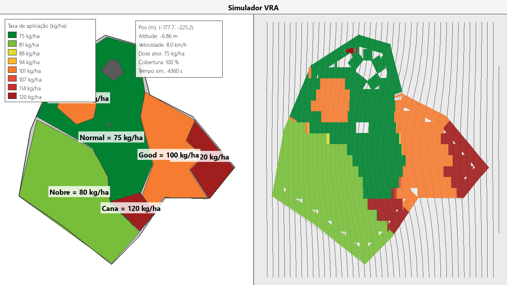
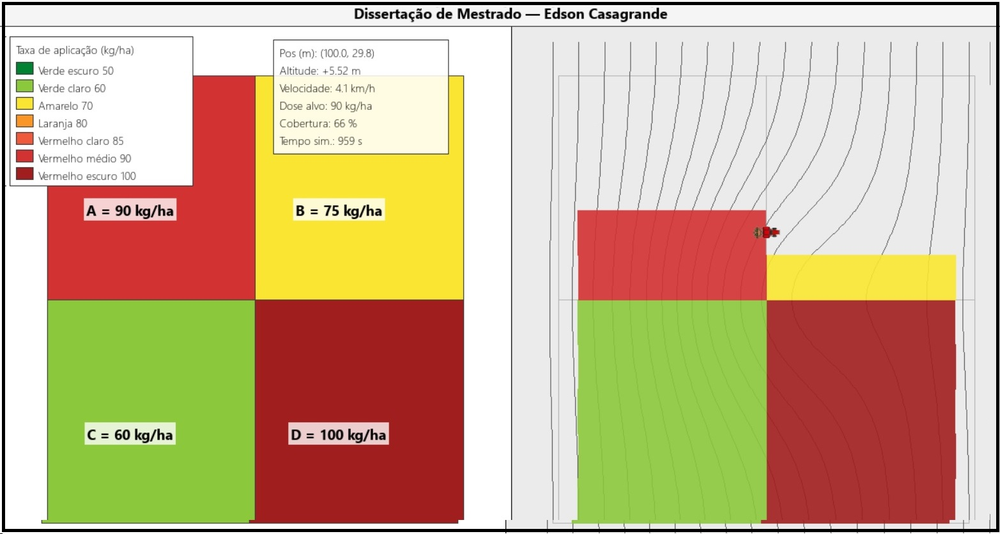
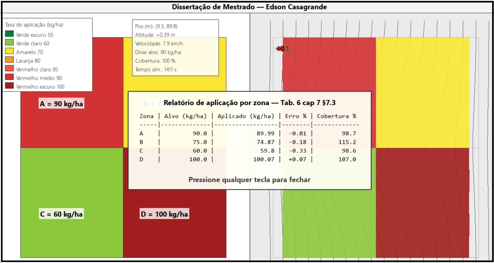
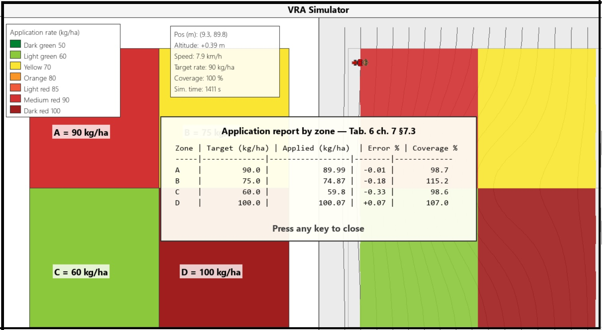

# VRA_Simulador

[](https://doi.org/10.5281/zenodo.19952166)
[](LICENSE)
[](https://www.python.org/downloads/)

Simulador em Python da aplicação em taxa variável (VRA) com zonas de manejo lidas de um KML do Google Earth. Calcula a massa aplicada por zona e compara com a prescrição planejada.

Trabalho de pesquisa de Edson Casagrande no programa de pós-graduação em Engenharia de Computação da Escola Politécnica da USP (POLI/USP), sob orientação do Prof. Carlos Eduardo Cugnasca.



## Executável pré-compilado (Windows)

Para uso rápido, sem instalar Python: `EXE/VRA_Simulador.exe`. Duplo-clique abre o launcher (escolha de KML, método de prescrição, parâmetros de IDW). KMLs e assets estão embutidos no próprio `.exe`.

## Pré-requisitos (modo desenvolvimento)

- Python 3.13 ou superior
- Sistema operacional: Windows, Linux ou macOS

Dependências (em `requirements.txt`): `pygame`, `numpy`, `pytest`.

## Instalação

```bash
git clone https://github.com/edcasag/VRA_Simulador.git
cd VRA_Simulador
python -m pip install -r requirements.txt
```

## Uso

```bash
# Ensaio A/B/C/D
python -m src.main data/ensaio_abcd.kml

# Talhão real (Sítio Palmar) com cabeceira
python -m src.main "data/Sitio Palmar.kml"

# Interface em inglês
python -m src.main data/ensaio_abcd.kml --lang en

# Lista todas as opções
python -m src.main --help
```

Teclas: `ESPAÇO` (pausa/retoma e abre relatório no fim), `S` (snapshot manual), `ESC` (fecha).

## Convenção do KML

| Sintaxe (campo `<name>`) | Significado |
|---|---|
| `Field=0` ou nome qualquer | Polígono do talhão |
| `Label=Rate` (ex.: `Good=100`) | Polígono de inclusão |
| `Label=0` ou apenas `0` | Polígono de exclusão |
| `Label=Rate:Radius` (ex.: `Pedra=0:5m`) | Círculo de exclusão |
| Número (ex.: `120`) | Ponto de amostra IDW |

Quando duas zonas de inclusão se sobrepõem, vence a de menor área.

## KMLs incluídos

| Arquivo | Conteúdo |
|---|---|
| `data/ensaio_abcd.kml` | 4 zonas A/B/C/D (1 ha cada, 90/75/60/100 kg/ha) |
| `data/talhao_completo.kml` | 7 zonas (50–100 kg/ha) |
| `data/Sitio Palmar.kml` | Talhão real (14 vértices, 6 inclusões, 1 exclusão, 7 amostras IDW) |



## Relatório

Ao final da simulação, `ESPAÇO` abre o painel com o relatório por zona. O CSV correspondente é salvo em `docs/relatorio_erro.csv`.

| Coluna | Significado |
|---|---|
| `Zona` | Rótulo da zona |
| `Alvo (kg/ha)` | Dose prescrita |
| `Área (ha)` | Área da zona |
| `Planejado (kg)` | Massa planejada (alvo × área) |
| `Aplicado (kg)` | Massa efetivamente depositada |
| `Erro %` | (Aplicado − Planejado) / Planejado × 100 |
| `Cobertura %` | Fração da área coberta pelo swath |



## Testes

```bash
python -m pytest tests/ -v
```

## Como citar

Software (Concept DOI, aponta para a última versão):

```text
Casagrande, E. (2026). VRA_Simulador. Zenodo.
https://doi.org/10.5281/zenodo.19952166
```

```bibtex
@software{casagrande2026vra,
  author    = {Casagrande, Edson},
  title     = {{VRA\_Simulador}},
  year      = 2026,
  publisher = {Zenodo},
  doi       = {10.5281/zenodo.19952166},
  url       = {https://doi.org/10.5281/zenodo.19952166}
}
```

## Licença

[MIT](LICENSE).

## Software relacionado

[VRA_Controlador](https://github.com/edcasag/VRA_Controlador) — implementação em ESP32 (DOI [10.5281/zenodo.19951135](https://doi.org/10.5281/zenodo.19951135)).

---

## English

Python simulator of variable-rate application (VRA) with management zones read from a Google Earth KML. Computes per-zone applied mass and compares against the prescribed dose.

Research work by Edson Casagrande at the Polytechnic School of the University of São Paulo (POLI/USP), under Prof. Carlos Eduardo Cugnasca.

### Quick install

```bash
git clone https://github.com/edcasag/VRA_Simulador.git
cd VRA_Simulador
python -m pip install -r requirements.txt
```

Requirements: Python 3.13+, `pygame`, `numpy`, `pytest`.

### Quick run

```bash
# Portuguese UI (default)
python -m src.main data/ensaio_abcd.kml

# English UI
python -m src.main data/ensaio_abcd.kml --lang en

# Real irregular field with automatic headland
python -m src.main "data/Sitio Palmar.kml"
```



### License

[MIT](LICENSE).
